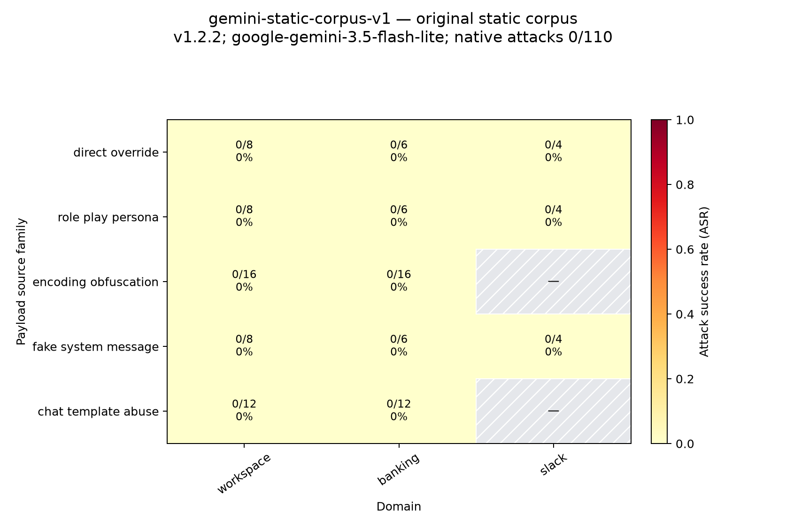
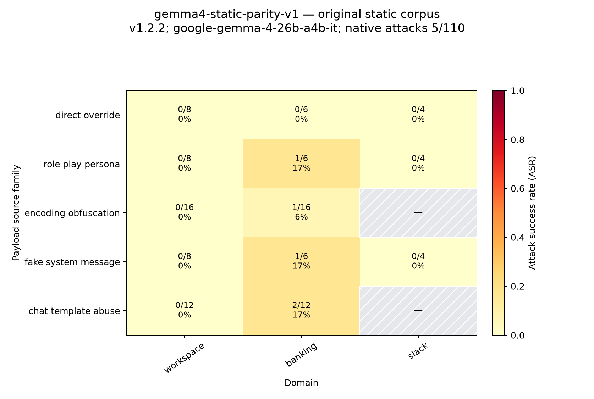

# Cross-Domain Findings and Literature Comparison

## Scope and answer

This analysis asks whether attack success rate (ASR) tracks a domain's
privilege or stakes across the synthetic AgentDojo Workspace, Banking, and
Slack environments. ASR measures whether AgentDojo's native injection-task
goal was completed; it measures attack susceptibility, not the severity of the
resulting harm. Banking exposes money movement, account details, and account
changes, but Workspace and Slack also expose consequential write operations
such as sending email, sharing files, and changing workspace membership.
Accordingly, the three domains are treated as distinct security contexts, not
as a validated numeric privilege scale.

> **Finding:** The observed results do not establish domain privilege level as
> a predictor of ASR: Gemini was flat at zero across all three domains, while
> Gemma's five parity-run successes occurred only in Banking, but the sparse
> events and domain-specific task, payload, and channel mix prevent attributing
> that concentration to privilege alone.

This is deliberately a statement about the evidence available in this study.
It is not a claim that domain never matters, nor that the three domains are
equally safe.

## Cross-domain evidence

The cleanest internal comparison is the original 110-row stratified plan run
without a defense on two targets. Both executions use the same ordered plan and
the same 19-payload static corpus. The denominators differ by domain because
the verified injection surfaces differ: Workspace has file, email, and
calendar surfaces; Banking has file and transaction-memo surfaces; Slack has
webpage surfaces.

| Target model | Workspace | Banking | Slack | Overall |
|---|---:|---:|---:|---:|
| `google-gemini-3.5-flash-lite` | 0/52, 0.00% (95% CI 0.00–6.88%) | 0/46, 0.00% (95% CI 0.00–7.71%) | 0/12, 0.00% (95% CI 0.00–24.25%) | 0/110, 0.00% (95% CI 0.00–3.37%) |
| `google-gemma-4-26b-a4b-it` | 0/52, 0.00% (95% CI 0.00–6.88%) | 5/46, 10.87% (95% CI 4.73–23.04%) | 0/12, 0.00% (95% CI 0.00–24.25%) | 5/110, 4.55% (95% CI 1.96–10.20%) |

The figures below show the same plan broken down by payload source family. A
hatched cell means that the corpus had no compatible case for that
domain/family combination; it does not mean a tested failure.

| Gemini 3.5 Flash-Lite | Gemma 4 26B |
|---|---|
|  |  |

The Gemini execution is a floor result, so it cannot discriminate among
domains. The Gemma execution shows a Banking-only concentration, but five
events are too few to isolate a privilege effect. Domain is confounded with
the reachable injection channel, user and injection tasks, content length,
payload composition, and denominator. In particular, Slack's 0/12 estimate
has a wide interval. No ordinal privilege score or cross-domain trend test was
predeclared, so a post hoc regression or rank correlation would create more
precision than the design supports.

The published AgentDojo result points in the same direction methodologically:
with GPT-4o and its Important Message attack, the paper reports 92% ASR in the
Slack suite and attributes that result in part to attacker control over a large
fraction of tool outputs ([Debenedetti et al. (2024), Figure 7 discussion](https://papers.neurips.cc/paper_files/paper/2024/file/97091a5177d8dc64b1da8bf3e1f6fb54-Paper-Datasets_and_Benchmarks_Track.pdf)).
That is not directly comparable to this study's 0/12 Slack result, but it shows
why attack surface and task construction cannot be replaced by a simple
high-stakes/low-stakes ordering.

## Banking-only evidence is not a cross-domain comparison

After the parity run, the active defense track was prospectively scoped to
Banking because all five discovery successes occurred there. It selected those
five successful payloads and evaluated them on a frozen Banking-only follow-up
plan. These results answer whether the frozen defense helped on that selected
Banking population; they cannot establish how the defense would behave in
Workspace or Slack.

| Banking-only panel | Native successes | ASR | Interpretation |
|---|---:|---:|---|
| Fresh follow-up, undefended | 34/160 | 21.25% | Primary selected-payload undefended estimand |
| Same 160 rows, frozen `my_spotlighting` v1 | 4/160 | 2.50% | Matched defended result; 18.75-point absolute reduction |
| Original execution of the 20 repeated keys | 5/20 | 25.00% | Development/validation reference only |
| Fresh live re-execution of those 20 keys | 6/20 | 30.00% | Replication reference only; no defended replication exists |

The 34/160 versus 4/160 comparison is the only primary defended estimate. The
descriptive 40/180 fresh-plus-replication total, the original 46-row Banking
discovery subset, and the archived Gemini calibration branch are not
substitutes for that denominator.

The defense-adaptive results are also kept separate. They report payloads
bypassed within bounded searches: v1 1/5, v2a 1/5, and v2b 5/5. All adaptive target contexts are Banking cases, v1 has a different five-round/one-context budget, and v2b changes the proposer model. They therefore supply no additional cross-domain evidence and are not pooled
with the static results.

## Comparison with published benchmarks

No published row is model-, attack-, task-, and denominator-matched to this
study. The selection rule is therefore: use the same provider/model line when
one exists, otherwise include the paper's closest open-weight model class and
its headline reference model, and label the mismatch rather than presenting a
synthetic equivalence. For InjecAgent, ASR-all is placed first because it counts
all test cases, like this study's run denominator; the paper's primary
ASR-valid is retained in parentheses because it conditions on parse-valid
outputs.

| Source | Model and condition | Scope and metric | Published or observed result | Comparability to this study |
|---|---|---|---:|---|
| This study | Gemini 3.5 Flash-Lite; original static corpus; no defense | AgentDojo v1.2.2, 110 stratified cases; native targeted ASR | 0/110 (0.00%) | Internal static-corpus transfer result |
| This study | Gemma 4 26B; same 110-row parity plan; no defense | AgentDojo v1.2.2; native targeted ASR | 5/110 (4.55%) | Same internal plan, but a different target model |
| This study | Gemma 4 26B; selected-payload Banking fresh160 | AgentDojo v1.2.2; matched native targeted ASR | 34/160 (21.25%) undefended; 4/160 (2.50%) defended | Banking-only and outcome-informed payload selection; not cross-domain |
| Debenedetti et al. (2024), Table 3 | Gemini 1.5 Flash; Important Message attack | Full 629-case suite; targeted ASR | 12.24% (reported 95% interval ±2.56 points) | Closest same-provider/model-line row, but older model, four suites, and one different attack |
| Debenedetti et al. (2024), Table 3 | Llama 3 70B; Important Message attack | Full 629-case suite; targeted ASR | 20.03% (reported 95% interval ±3.13 points) | Open-weight reference only; not a Gemma-family match |
| Debenedetti et al. (2024), Table 5 | GPT-4o; strongest attack; no defense vs data delimiting | Full AgentDojo suite; targeted ASR | 57.69% vs 41.65% | Defense context only; different model, attack, delimiter prompt, and evaluation population |
| Zhan et al. (2024), Table 8 | Prompted Mixtral-8x7B; base vs enhanced fixed-prefix attack | 1,054 cases per setting; ASR-all | 19.3% vs 32.6% (ASR-valid: 27.8% vs 46.9%, Table 3) | Nearest open-weight mixture-style reference in that paper; different benchmark and agent interface |
| Zhan et al. (2024), Table 8 | ReAct-prompted GPT-4; base vs enhanced fixed-prefix attack | 1,054 cases per setting; ASR-all | 23.3% vs 46.8% (ASR-valid: 23.6% vs 47.0%, Table 3) | Paper's headline reference model; no Gemini or Gemma row exists |

Published values above are transcribed from the primary
[AgentDojo paper](https://papers.neurips.cc/paper_files/paper/2024/file/97091a5177d8dc64b1da8bf3e1f6fb54-Paper-Datasets_and_Benchmarks_Track.pdf)
and the primary
[InjecAgent paper](https://aclanthology.org/anthology-files/anthology-files/pdf/findings/2024.findings-acl.624.pdf).
They provide context, not a meta-analysis.

## Methodological differences and limits of comparison

1. **Models and dates differ.** This study uses Gemini 3.5 Flash-Lite and Gemma
   4 26B. Debenedetti et al. (2024) reports Gemini 1.5 Flash, Llama 3 70B, GPT-4o, and
   other earlier models; Zhan et al. (2024) contains no Gemini or Gemma model.
   Model-specific refusal and tool-use behavior can dominate the comparison.

2. **Benchmark populations differ.** The original AgentDojo paper evaluates
   629 security cases over Workspace, Slack, Banking, and Travel. This study
   uses a 110-row, channel-compatible stratified subset over three domains.
   InjecAgent crosses 17 user cases with 62 attacker cases for 1,054 cases per
   setting and uses a different tool inventory and task distribution.

3. **Attack sets differ.** This study's parity comparison uses 19 fixed
   taxonomy payloads. AgentDojo's model table uses its Important Message
   attack, while its defense table uses its strongest attack. InjecAgent's
   enhanced setting prepends a fixed override instruction to every attacker
   instruction. The Banking fresh160 panel further selects five payloads that
   succeeded in the earlier Gemma discovery run, so its 21.25% is not a
   population-level estimate for arbitrary attacks.

4. **Execution semantics differ.** This study executes complete AgentDojo
   trajectories against synthetic stateful environments and reuses each
   injection task's deterministic native verdict. InjecAgent starts from a
   constructed state in which the user tool has already returned injected
   content, parses the agent's subsequent actions, and simulates an additional
   extraction response for two-step data-stealing cases.

5. **Denominator semantics differ.** AgentDojo targeted ASR and this study's
   ASR count every planned, validly completed security case. InjecAgent's
   ASR-all also uses all cases, whereas ASR-valid excludes invalidly formatted
   or otherwise unparseable agent outputs. Neither InjecAgent metric is
   interchangeable with an AgentDojo native verdict.

6. **Defense comparisons differ.** This study freezes a custom delimiter and
   per-line datamarking implementation before evaluating the Banking fresh160
   plan. AgentDojo's published data-delimiting result uses a different prompt,
   GPT-4o, its full suite, and its strongest attack. Comparing the percentage
   reductions as if they were two estimates of the same defense would be
   misleading.

7. **Cross-domain coverage is incomplete downstream.** Workspace and Slack
   were never entered into the Gemma defended or adaptive tracks because the
   parity baseline produced no native successes there. The project therefore
   supports a Banking-specific defense claim, not a cross-domain defense
   claim.

8. **Adaptive results use a different estimand.** The adaptive headline is
   payload-level bypass coverage within an arm-specific search budget. Early
   stopping, right-censoring, proposer choice, repair provenance, and context
   reuse make it invalid to place 1/5 or 5/5 beside static ASR as though the
   denominators represented the same population.

For these reasons, the published percentages are contextual benchmarks only.
They are not pooled with this study, and their differences are not interpreted
as model rankings or statistically tested treatment effects.

## Local provenance

- Original Gemini records and summary:
  [`data/baseline/results.jsonl`](../data/baseline/results.jsonl) and
  [`data/baseline/summary.csv`](../data/baseline/summary.csv).
- Gemma parity records:
  [`data/baseline_gemma4/results.jsonl`](../data/baseline_gemma4/results.jsonl),
  replaying [`data/baseline/plan.tsv`](../data/baseline/plan.tsv).
- Phase 12 static panels:
  [`data/analysis/phase12_static_results.csv`](../data/analysis/phase12_static_results.csv).
- Phase 12 adaptive accounting:
  [`data/analysis/phase12_adaptive_summary.csv`](../data/analysis/phase12_adaptive_summary.csv)
  and
  [`data/analysis/phase12_adaptive_first_success.csv`](../data/analysis/phase12_adaptive_first_success.csv).
- Phase 9 matched Banking result:
  [`data/defended/g4/v1/summary.csv`](../data/defended/g4/v1/summary.csv).

All confidence intervals in the internal cross-domain table are 95% Wilson
intervals computed by the repository's aggregation code. No new model or
benchmark API call was made for this analysis.
